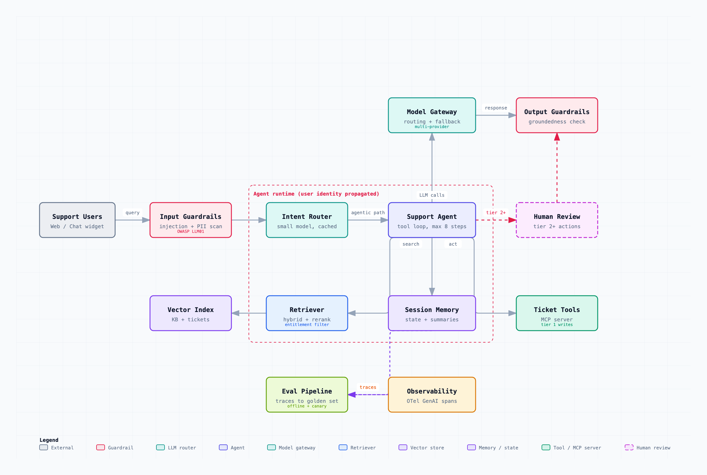
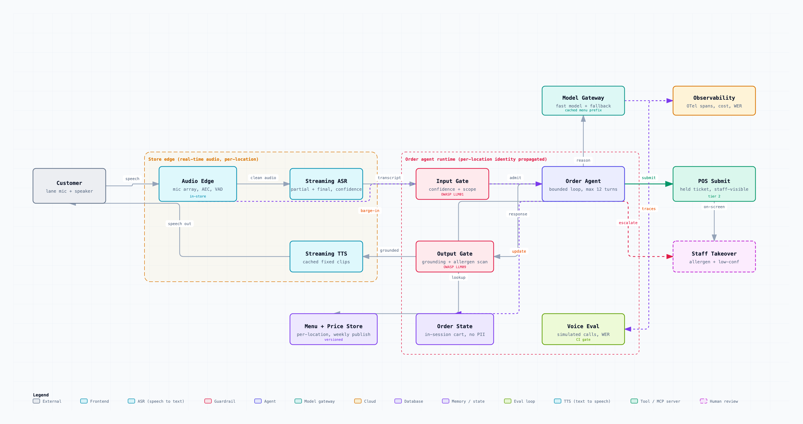
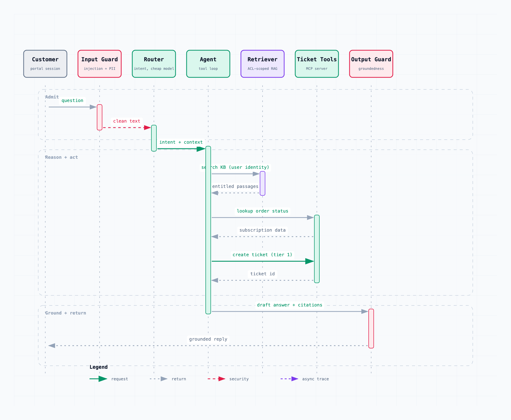

# Agentify

**Turn a use case into a grounded agentic system design.**

[**Quickstart site**](https://avnath13.github.io/agentify/) &middot; [Example gallery](https://avnath13.github.io/agentify/#gallery) &middot; [Releases](https://github.com/avnath13/agentify/releases)

Agentify is an agent skill that works like a seasoned AI solutions architect. Describe what you want to build ("an AI support agent for our customer portal", "a document assistant for our law firm"), answer a short round of clarifying questions, and receive a detailed, defensible system design document: requirements and NFRs, an explicit decision record, a justified component architecture, security and evaluation plans, cost math, a rollout plan, and interactive architecture diagrams embedded inline. Every architectural decision cites an authoritative source.

The output is a single self-contained HTML file with a dark/light theme toggle, a navigable table of contents, and embedded SVG diagrams. No dependencies, no network calls, shareable anywhere.

<picture>
  <source media="(prefers-color-scheme: dark)" srcset="docs/assets/support-agent-architecture-dark.png">
  
</picture>

<sub>A generated architecture, drawn with agent-native components: guardrails, an intent router, the agent runtime boundary where the user identity is propagated, permission-aware retrieval, tools as an MCP server, a human-review gate, and the eval and observability loop. This is one figure from the <a href="examples/enterprise-support-agent.design.html">support agent design document</a>.</sub>

## Features

- **Grounded, cited reasoning.** Every architectural decision cites a knowledge-base document (which carries primary-source citations) or a dated live source. No uncited claims.
- **The escalation ladder.** Forces the design up from deterministic code, to a single augmented LLM call, to workflow patterns, to an agent, to multi-agent, with a written justification for every climb and an anti-escalation rule that says when a simpler rung wins.
- **Seven decision trees** for the choices that matter: whether you need generative AI at all, RAG vs fine-tuning vs long context, single vs multi-agent, autonomy tiers with enforcement gates, and memory tiers.
- **Domain-harm analysis.** Asks what happens if the system is wrong or abused and scales the guardrails to that harm, not to company size.
- **Right-sizing.** Classifies a design lightweight or enterprise and sizes the document to match, so a small feature is not buried in tenant-isolation and DR ceremony.
- **Two modes.** Production (the design you should build) and interview (the same rigor framed as a system design interview answer, with per-section coaching).
- **A self-contained deliverable.** One HTML file with a dark and light theme toggle, a navigable table of contents, print-to-PDF, and embedded interactive diagrams. No dependencies, no network calls.
- **Agent-native diagrams.** Architecture, sequence, data-flow, and lifecycle diagrams with a vocabulary built for agentic systems (agent, router, retriever, vector store, guardrail, eval loop, human review, tool, memory, queue, ASR, TTS).
- **A broad, audited knowledge base.** Vendor agent guides, cloud well-architected frameworks, peer-reviewed surveys, standards bodies (OWASP, NIST, MCP, OpenTelemetry), evaluation frameworks, and voice and multimodal design, spot-checked against primary sources.
- **A reasoning eval harness.** Golden cases with expected decisions guard against regressions in the design logic, run in CI.
- **Install-free.** Ship as a skill; the CLI and validators run with no `npm install`.

## Why

Asking an LLM to "design an agentic system" produces plausible-sounding but ungrounded output: components with no justification, agents where a workflow would do, security as an afterthought. Agentify forces the design through the published engineering canon instead:

- The **escalation ladder**: deterministic code, then a single augmented LLM call, then workflow patterns, then an agent, then multi-agent. Every climb needs written justification, and the design must say when a simpler rung wins.
- **Decision trees** for the choices that matter: do you need generative AI at all, RAG vs fine-tuning vs long context, single vs multi-agent topology, autonomy tiers with enforcement gates, memory tiers.
- An **enterprise bar**: every component carries the requirement it serves, its scaling model, its failure mode and fallback, and a concrete technology example. NFRs are numbers, not adjectives. Cost math is shown, including the 10x scenario.

## What grounds it

Agentify ships with a versioned knowledge base (in [`agentify/knowledge/`](agentify/knowledge/)) distilled from primary sources, cited inline in every design:

| Category | Sources |
|---|---|
| Agent design | Anthropic (Building Effective Agents, context engineering, multi-agent research system), OpenAI (A Practical Guide to Building Agents), Google/Kaggle Agents whitepaper, Andrew Ng's agentic patterns |
| System design | The customer-facing GenAI design loop (Selamy), Chip Huyen's AI Engineering, the a16z LLM application stack |
| Enterprise architecture | AWS Well-Architected Generative AI Lens, Azure WAF AI workloads, Google Cloud Architecture Framework |
| Research | arXiv surveys covering RAG, agentic RAG, multi-agent collaboration and orchestration, LLM-as-judge, the tau-bench reliability benchmark, agentic multimodal models, and multimodal hallucination |
| Voice and multimodal | Cascaded vs speech-to-speech architecture, turn-taking (VAD, endpointing, barge-in), the conversational latency budget, and audio-native evaluation, from OpenAI, LiveKit, ElevenLabs, and the voice-agent testing literature |
| Standards | OWASP Top 10 for LLM Applications (2025) and for Agentic Applications (2026), NIST AI RMF and its GenAI Profile, the Model Context Protocol, OpenTelemetry GenAI semantic conventions |
| Evaluation | RAGAS, the TruLens RAG Triad, eval-driven development practice |

Facts that go stale (model choices, pricing) are never baked in: designs pull them live at generation time and stamp them with the retrieval date. Provenance for every source lives in [`SOURCES.md`](agentify/knowledge/SOURCES.md).

## Two modes

- **Production mode** (default): the design your team should build. Concrete, opinionated, buildable.
- **Interview mode**: the same rigor framed as a system design interview answer. Each section adds what a strong candidate says, what interviewers probe next, and the tradeoffs to voice out loud. Useful for preparing for GenAI system design loops.

## Quick start

### Install

```bash
npx skills add avnath13/agentify -g
```

Other ways to install:

```bash
# Project-local instead of global
npx skills add avnath13/agentify

# Manual: download agentify.zip from the latest release and add it as a skill
# in Claude, Codex CLI, or opencode.
```

The skill is dependency-free at runtime; nothing to `npm install` to use it.

### Use it

Describe what you want to design, in your own words:

> Design an AI agent that triages our inbound sales leads: reads the inquiry, enriches it from our CRM, scores it, and drafts a response for rep approval. About 300 leads per day.

Agentify asks only the questions whose answers change the design (data permissions, latency and cost targets, autonomy limits, compliance), walks its decision trees, and writes `<use-case>.design.html`.

Then **iterate in chat**. The design is a conversation, not a one-shot:

> Make it production mode and assume 99.99% availability and a 200ms p50 budget.

> Re-run assuming we cannot use an external model provider, on-prem only.

> The compliance team says this is now in scope for HIPAA. Update the security and data sections.

For interview practice, ask for interview mode:

> In interview mode: design a customer-facing RAG assistant for a retail bank.

## Example prompts

Production designs:

- "Design an AI support agent for our customer portal. It answers product questions from our docs and knowledge base, looks up order and subscription status, and files tickets. About 450 tickets per day, and it should escalate to a human when unsure."
- "We want an internal copilot that answers questions over our wiki and Slack history, with per-team permissions so nobody sees another team's private channels."
- "Design a compliance assistant over five years of contracts that answers with citations to the source clause. Strictly read-only."
- "Design a coding agent that turns a bug ticket into a tested pull request for our monorepo. It must never merge and never touch production."
- "Design an agent that drafts first-response emails for our support inbox, pulls order data, and hands off anything about refunds to a human."

Interview mode:

- "In interview mode: design a customer-facing RAG assistant for a bank."
- "In interview mode: design a multi-tenant meeting-notes summarizer with strict tenant isolation."

Refining an existing design (just keep talking):

- "Cut the cost ceiling to 0.05 USD per conversation and show me what changes."
- "Assume traffic is bursty, 10x peaks around launches. Redo the scale section."
- "Swap the vector store recommendation for something we can self-host."

## What a design contains

Fifteen sections, each with a defined pass bar: executive summary, requirements and NFRs, decision record (with rejected alternatives), system architecture, data and retrieval, tools and integrations, state and memory, security and guardrails, evaluation plan, observability, scale and cost analysis, failure modes and degradation, rollout plan, a request walkthrough, and references.

In interview mode each section also carries a collapsible "interview notes" block: what a strong candidate says, the follow-ups the interviewer will probe, and the tradeoff to voice.

## Diagram vocabulary

Agentify draws four diagram types, using the bundled engine, and embeds them in the design:

| Type | Shows |
|---|---|
| **Architecture** | Components, trust boundaries, and how requests flow between them |
| **Sequence** | The primary request path, including guardrail and retrieval hops |
| **Data flow** | Ingestion and retrieval pipelines, PII boundaries, freshness |
| **Lifecycle** | State machines: an agent run, a ticket, an order, with retries and terminal exits |

Beyond the usual infrastructure boxes, the engine adds an **agent-native component vocabulary** so the picture matches the frameworks, each with its own color family:

| Component | For |
|---|---|
| `agent` | an LLM-driven agent loop |
| `llm-router` | intent or model routing |
| `model-gateway` | provider gateways, model API front doors, fallback |
| `retriever` | query-time retrieval services |
| `vector-store` | vector or hybrid indexes |
| `memory-state` | conversation state, agent memory |
| `guardrail` | input/output guardrails, content filters |
| `eval-loop` | evaluators, critics, quality gates |
| `human-review` | human approval gates (drawn with a dashed border) |
| `tool` | tools, MCP servers, function endpoints |
| `queue` | queues and task buses between agents |

The full palette and semantics are documented in [`schemas/README.md`](agentify/schemas/README.md).

## Using the output

**The design document** (`<use-case>.design.html`) is a single self-contained file:

- **Theme toggle** in the top right, persisted to `localStorage`, respecting your system preference. Force a theme with `?theme=light` or `?theme=dark` for deterministic screenshots.
- **Table of contents** with scroll-spy that highlights the section you are reading.
- **Print to PDF** with `Cmd/Ctrl+P`; a print stylesheet flattens it to clean pages (interview notes are hidden in print).
- **Fully self-contained**: no external requests, no CDNs, no fonts fetched. Safe to email, commit, or open offline.

**Standalone diagrams.** If you render a diagram on its own with the CLI (see below), the generated HTML adds an export and keyboard layer:

- **Export menu**: copy the PNG to your clipboard, or download PNG / JPEG / WebP at up to 4x resolution, or a **dual-theme SVG** that follows the reader's `prefers-color-scheme` (ideal for embedding in a GitHub README).
- **Keyboard**: press `T` to toggle theme, `E` to open the export menu.
- **URL params**: `?theme=light|dark` and `?openExport=1`.

To turn a rendered diagram into README-ready images (light and dark PNGs plus a standalone SVG), run `npm run assets:readme` from `agentify/`, or the underlying `scripts/rasterize-diagram.mjs` and `scripts/export-standalone-svg.mjs` on any rendered diagram.

## Example gallery

Three complete generated designs are committed in [`examples/`](examples/); open any in a browser, each is fully self-contained:

- [**Enterprise support agent**](examples/enterprise-support-agent.design.html) for a B2B SaaS company. A single tool-using agent behind an intent router, permission-aware RAG, autonomy tiers 0 to 1 with human escalation, and the full cost and latency math.
- [**Legal document assistant**](examples/rag-document-assistant.design.html) for a 900-lawyer firm. Deliberately not an agent: a routed retrieval workflow where daily-changing ethical walls make permission-aware retrieval the crux. Shows the anti-escalation rule rejecting an agent on the record.
- [**Autonomous coding system**](examples/multi-agent-coding-system.design.html), in interview mode. A bounded agent per ticket with a reflection loop, sandboxed with no merge or deploy access, and an explicit single vs multi-agent economics argument. Each section carries interview coaching notes.
- [**Recipe assistant**](examples/recipe-assistant.design.html), a lightweight consumer feature. The right-sizing rule at work: it lands at Rung 1 (a single extraction call over deterministic matching, no agent, no vector RAG) and produces a short document, while still treating allergens as a full-depth safety concern.
- [**Drive-through voice agent**](examples/drive-through-voice.design.html). A cascaded voice design with the conversational latency budget, turn-taking (VAD, endpointing, barge-in), and audio-native evaluation, drawn with the speech component types.

Each design embeds diagrams drawn with the agent-native vocabulary: a component architecture plus a request sequence, a ticket lifecycle state machine, or a voice pipeline.

<picture>
  <source media="(prefers-color-scheme: dark)" srcset="docs/assets/drive-through-voice-dark.png">
  
</picture>

<sub>The drive-through voice design, showing the cascaded speech pipeline (streaming ASR and TTS in the store edge), barge-in, the bounded order agent, the tier-2 POS submit gated on read-back, and staff takeover for allergens or low confidence.</sub>

<picture>
  <source media="(prefers-color-scheme: dark)" srcset="docs/assets/support-agent-query-dark.png">
  
</picture>

<sub>The request sequence for a single turn, from the support agent design. Retrieval and tools run under the caller identity, and the output guardrail checks groundedness before the reply is returned.</sub>

## How it works

1. **Intake and clarify.** The skill reads your use case and asks only the missing questions that would change the design, drawn from a discovery checklist (business context, data and permissions, autonomy and risk, load, latency, availability, cost, compliance).
2. **Decide.** It walks seven decision trees synthesized from the knowledge base, recording the answer, the reasoning, and the citation at every gate, including the alternatives it rejected.
3. **Design.** It writes the document section by section against the enterprise bar, doing the capacity and cost math with live-sourced pricing.
4. **Diagram and render.** It emits diagram JSON, validates it against bundled schemas, renders self-contained SVG/HTML, runs post-render quality checks, and assembles everything into one document.
5. **Self-check.** A final gate checklist rejects the design if any escalation is unjustified, any component is unexplained, or any claim is uncited.

## Repository layout

```
agentify/            the installable skill
  SKILL.md           persona, loop, and rules
  knowledge/         the grounded knowledge base (14 documents + provenance)
  schemas/           diagram JSON schemas (with agent-native component types)
  renderers/         deterministic JSON-to-SVG/HTML renderers
  templates/         design document shell + per-section requirements
  scripts/           validators, example rendering, README asset generation
  bin/agentify.mjs   CLI: render / validate / check / examples / doctor
examples/            generated design documents (the gallery) + diagram sources
docs/assets/         rendered diagram previews used in this README
```

## CLI

The bundled renderer works standalone:

```bash
cd agentify
node bin/agentify.mjs render architecture my-system.architecture.json out.html
node bin/agentify.mjs validate architecture my-system.architecture.json
node bin/agentify.mjs check out.html
node bin/agentify.mjs assemble my-system.design.md out.design.html   # design doc
node bin/agentify.mjs adr my-system.decisions.md                     # ADR files + index
node bin/agentify.mjs doctor      # verify the install is healthy
node bin/agentify.mjs examples    # re-render the bundled examples
```

Diagram types: `architecture`, `workflow`, `sequence`, `dataflow`, `lifecycle`.

## Technical details

- **Self-contained output.** Generated HTML has zero runtime dependencies and makes no network calls. Diagrams are inline SVG themed by CSS variables.
- **Deterministic renderers.** The same JSON always produces the same HTML, enforced by golden tests, so edits are reviewable in `git diff`.
- **Install-free validation.** JSON Schemas are precompiled to standalone validators and shipped with the skill, so schema and layout checks run with no `npm install` and no network.
- **Node 18+** for the CLI. The skill itself needs only the agent runtime.
- **Grounding freshness.** Framework knowledge is bundled and cited; volatile facts (model names, pricing) are pulled live at generation time and dated, never frozen into the repo.
- **House style.** No em dashes anywhere, enforced by CI.

## Roadmap

Now: the skill, the grounded knowledge base, the extended diagram engine, and three gallery designs are shipping in v0.1.0.

Next: running the skill against a wide set of unscripted prompts to tune the clarification loop, a knowledge-base freshness workflow, design diffing (compare two designs for the same prompt), and export to an ADR format. Non-goals and the full list are in [ROADMAP.md](ROADMAP.md).

## Contributing

The knowledge base is the heart of this project and has a defined bar for sources (vendor engineering guides, peer-reviewed surveys, standards bodies, cloud well-architected frameworks, university courses). See [CONTRIBUTING.md](CONTRIBUTING.md) for the three contribution surfaces (knowledge, engine, examples) and the style rules, and use the "Knowledge source proposal" issue template to suggest sources.

## Credits

The diagram engine is a fork of [Archify](https://github.com/tt-a1i/archify) by tt-a1i (MIT), itself based on Cocoon AI's architecture-diagram-generator. Agentify vendors and extends that engine with agent-native component types; the deterministic renderer design, schema validation approach, and self-contained HTML output are Archify's work, and this project would not exist without it. The knowledge base stands on the published work of the teams and authors listed in [`SOURCES.md`](agentify/knowledge/SOURCES.md).

## License

MIT. See [LICENSE](LICENSE) for the full attribution chain.
